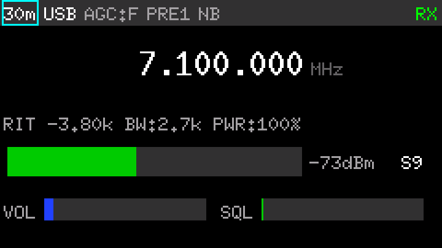
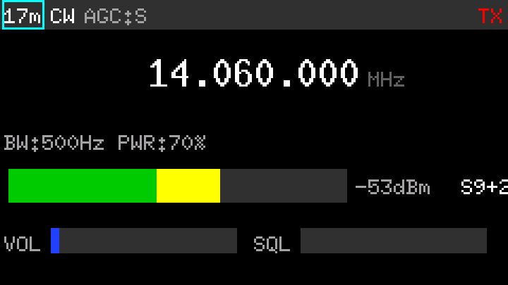
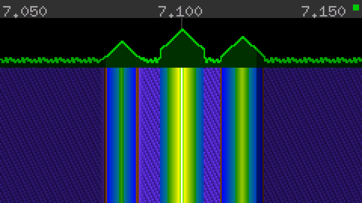
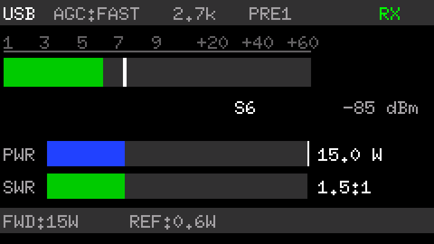
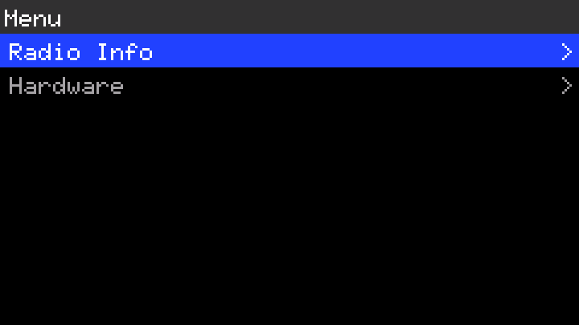
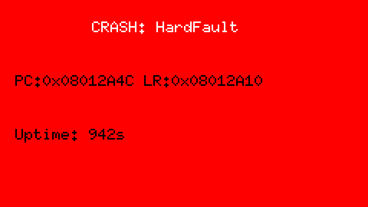

# Druzhba-M 2.0 / Дружба-М 2.0 ("Friendship") — Modern HF Transceiver

An open-source HF transceiver designed to fit a single-DIN slot (180x50 mm — the size of a car stereo). The goal is a compact, fully featured radio that competes with commercial transceivers like the Icom IC-7300 or Yaesu FT-891 in feature set, while being fully open-source and buildable from readily available components.

Based on the classic Soviet "Druzhba-M" superheterodyne architecture — a proven RF topology — with all control and signal management brought into the digital domain. PLL synthesis (Si5351), digital codecs, software-controlled filtering, USB-C power, and real-time DSP — in a package you can mount in a dashboard.

**Original design**: V. Abramov (UX5PS) & S. Telezhnikov (RV3YF) — [Druzhba-M on CQHAM.ru](https://www.cqham.ru/druzba-m.htm)

## Why This Exists

I was building an original Druzhba-M and got tired of endless manual calibration — trimming VFOs, matching transistors, aligning filters. The radio itself sounds great, the architecture is solid, but the analog control side is tedious to get right. So I decided to keep the RF design and replace all the fiddly analog control with digital — make it repeatable, make it compact, make it the best I can.

Every board is a custom PCB designed in EasyEDA. Schematics and netlists are in the `hardware/` directory.

## Key Design Decisions

**Superheterodyne, not SDR.** This is intentionally not a software-defined radio. The signal path is a real superheterodyne chain — BPF, mixer (FST3125 H-mode), 10 MHz crystal filter, IF amp, product detector — with each stage on its own module board. Digital control means every parameter is software-adjustable, but the RF path is analog where it matters.

**Why microcontrollers at all?** Every module board has digitally controlled components — DDS chips, DACs, ADCs, GPIO expanders, relay drivers. Something needs to orchestrate all of that: set frequencies, switch bands, read RSSI, manage gain, monitor power, handle USB, run the UI. A microcontroller with I2C buses and async firmware replaces what would otherwise be a rats nest of discrete logic and manual controls.

**Two-controller split.** The main controller runs the signal path and power management. A separate front panel controller handles displays, buttons, encoders, and headphone audio. They communicate over a high-speed SPI link. This keeps display rendering and UI polling away from time-sensitive RF control, and lets each side be developed and debugged independently.

**I2C for module control.** All module boards connect to the main controller via I2C buses. GPIO expanders (PCA9534, TCA9555) switch relays for band filters. DACs (MCP4725) set gain and bias voltages. ADCs (ADS1015, ADS1115) read RSSI, power levels, and temperatures. The Si5351 PLL synthesizer generates both VFO and BFO clocks, also controlled over I2C. Three separate I2C buses keep traffic isolated: main signal path, power monitoring, and external peripherals (filters, PA).

**Hardware DSP.** The STM32H5 has a CORDIC math coprocessor and an FMAC FIR accelerator. All trigonometric, exponential, and logarithmic math runs on the CORDIC hardware — no lookup tables, no software approximations. Audio filtering uses the hardware FMAC.

**USB-C Power Delivery.** The transceiver is powered via USB-C PD. The STM32H5's built-in UCPD peripheral negotiates power contracts directly — no external PD controller needed. The PA gets its 50V from a boost converter enabled only during transmit.

**Rust, async, no_std.** Fully async firmware on the Embassy framework. No RTOS, no heap, no unsafe. Every peripheral interaction is non-blocking. The system is event-driven with message passing between tasks.

## Signal Path

```
ANT -> LPF -> HPF -> BPF (7-band, PIN-switched)
  -> ATT / LNA (ERA-3SM+)
  -> H-mode mixer (SN74CBTLV3125 + 74AC86 + 3x ADT4-6T+)
    VFO: Si5351A CLK0, ftune + 10.700 MHz
  -> LC match 50 -> 330 Ohm
  -> SFECF10M7MA00 roofing filter (10.7 MHz, 50 kHz BW)
  -> LC match 330 -> 200 Ohm
  -> AD8367 #1 -> AD8367 #2 (IF amplifier / analog AGC, 200 Ohm diff.)
  -> balun 200 -> 50 Ohm
  -> ADE-1+ downconverter
    BFO: Si5351A CLK1, 10.650 MHz
  -> 2nd IF: 50 kHz
  -> anti-alias LPF 80 kHz
  -> CS4272 ADC (192 kHz, 24-bit)
  -> I2S -> STM32H563VI
  -> DSP: DDC (NCO + CIC3 + compensation FIR) -> NB -> selectivity (FIR, 100 Hz-25 kHz)
         -> AGC (digital + analog) -> demodulation (SSB/CW/AM/FM/SAM)
         -> CW peak filter -> audio LPF -> DAC
         + waterfall FFT (1024-pt, +/-25 kHz real-time + band scan)

TX: Mic -> DSP (HPF -> compressor -> limiter -> SSB/CW/AM/FM modulator -> 50 kHz IF)
    -> CS4272 DAC -> TS5A3157 -> ADE-1+ -> roofing filter -> IF amp
    -> mixer -> LPF -> HF PA (50W) -> antenna
```

## DSP Pipeline

Full software-defined signal processing on STM32H563 (Cortex-M33, 250 MHz):

**RX chain** (192 kHz ADC -> 48 kHz audio):
- DDC: CORDIC NCO at 50 kHz + 3rd-order CIC decimation (x4) + 15-tap compensation FIR
- Noise Blanker: threshold-based with linear interpolation
- Selectivity filter: FMAC (I-channel) + software FIR (Q-channel), Blackman-Harris window, 8 presets (200 Hz CW narrow to 15 kHz FM wide), arbitrary bandwidth 100 Hz - 25 kHz
- Digital AGC: 6 presets (SSB fast/slow, CW, AM, manual, off), per-mode attack/release/hang
- Analog AGC: MCP4725 DAC -> AD8367 VGA, target -12 dBFS, ADC overload protection
- Demodulators: USB, LSB, CW (pitch offset), AM (envelope + DC block), FM (fast_atan2 + 750us de-emphasis), SAM (PLL via CORDIC)
- CW peak filter: 63-tap bandpass centered on CW pitch
- Audio output LPF: 31-tap at 3400 Hz
- S-meter: S9 = -73 dBm, 6 dB/S-unit, calibration offset

**TX chain** (48 kHz audio -> 192 kHz DAC at 50 kHz IF):
- HPF 300 Hz (removes low-frequency artifacts)
- Audio compressor (4:1 above -12 dB threshold, 5 ms attack, 50 ms release)
- Hard limiter at 95% full scale
- SSB: 31-tap Hilbert transform (phasing method), I/Q upsampled and modulated onto 50 kHz NCO
- CW: raised cosine envelope (5 ms rise/fall) on 50 kHz carrier via CORDIC
- AM: carrier + modulation at 50 kHz
- FM: frequency modulation of 50 kHz NCO, +/-5 kHz deviation
- All modes upsample 48 -> 192 kHz with 63-tap interpolation FIR

**Waterfall**: Composite display with configurable span (50 kHz to full band, default 100 kHz). Center ±25 kHz from real-time 1024-point FFT (Hann window, CORDIC twiddle factors, exponential averaging). Outer bins from incremental band sweep (squelch-gated, ~130 ms cycle). Live/stale regions visually differentiated. When span ≤ 50 kHz, entire display is real-time FFT

## Module Boards

11 separate PCBs connected through a passive distribution board:

- **BPF** — Band-pass input filters, relay-switched per band
- **Mixer** — FST3125 H-mode mixer, Si5351 CLK0 local oscillator (25 MHz crystal, PLLA)
- **Crystal Filter** — 10 MHz IF, switchable bandwidths, noise blanker with adjustable threshold
- **IF Amplifier** — Variable gain via DAC, RSSI measurement via 12-bit ADC, preamp/attenuator
- **Detector** — Product detector with Si5351 CLK1 BFO (PLLB), AD8367 VGA for TX gain control, PCA9534 RX/TX switching
- **Audio Panel** — CS4272 stereo codec (192 kHz, 24-bit), I2S interface to main controller
- **LPF** — Low-pass output filters with AD8307 log-detector power measurement
- **HF Power Amplifier** — 50W, driver + final stage, DAC-controlled bias, NTC temperature monitoring
- **Control Board** — Power management (3x INA228), fan, USB (CDC + UAC1), USB-C PD, CW paddle, PTT
- **Front Panel** — 3x color IPS TFT (ST7789, 240x135), encoders, buttons, LEDs, WM8940 headphone codec
- **Distribution Board** — Passive connectors routing signals between modules

## Front Panel

Three small color IPS displays (ST7789, 240x135 each) show: main tuning screen with frequency/mode/levels, real-time spectrum with waterfall, and S-meter/power/SWR readings. Rotary encoders handle tuning and parameter adjustment. The front panel controller renders all UI locally — it receives state updates over the SPI link and handles display and input logic independently.

Headphone audio goes through a WM8940 mono codec on the front panel, receiving its stream from the main controller over SAI2.

### Display Screens

Each display has a dedicated render task and shows a fixed screen type. All rendering uses double-buffered framebuffers pushed over SPI DMA.

> Screenshots generated from actual render code. Run:
> `cargo test -p druzhba-front-panel-controller --no-default-features --test screenshots --target x86_64-pc-windows-msvc`

**Display 1 — Main Tuning** (240x135, ST7789)





Status bar (band, mode, AGC, RF gain, NB, RX/TX state), large frequency readout, RIT/XIT offset, filter bandwidth, RF power setting, S-meter bar with dBm/S-unit readout, volume and squelch bars. Navigable cursor highlights active parameter in cyan (selected) or yellow (editing).

**Display 2 — Spectrum + Waterfall** (240x135, ST7789)



Frequency labels (left edge, center, right edge), sweep status indicator (green=sweeping, yellow=listening, gray=idle). Top third: real-time spectrum plot (green line + fill, dimmed for stale/swept bins). Bottom two-thirds: scrolling waterfall spectrogram with 4-segment color mapping (dark blue -> green -> yellow -> red-orange, -120 to -20 dBm). Center frequency marker. Live and stale regions visually differentiated.

**Display 3 — Meter** (240x135, ST7789)



S-meter with classic scale (S1-S9, +20/+40/+60), gradient bar (green below S9, yellow above) with peak hold marker, dBm readout. Forward power bar (blue, 0-50W) with target marker. SWR bar (green normal, red above 2.0:1). Detail bar with FWD/REF power values.

**Menu Overlay** (replaces main screen when active)



Title bar, scrollable item list (max 8 visible), blue highlight on selected item. Submenu items marked with `>`. Currently: Radio Info (frequency, mode, band) and Hardware (FW version) submenus.

**Fatal Error** (shown on all 3 displays simultaneously)



Red background, fatal error info: init failure message or crash details from main controller (reset reason, PC/LR registers or panic file:line, uptime). Enters infinite loop — requires hardware reset. Non-fatal errors are logged silently and shown via a red "E:N" indicator in the status bar; the error log is accessible through the menu.

## Power System

Three INA228 high-side monitors track VBUS input, PA supply, and 3.3V rail in real time. Overcurrent protection with automatic shutdown. The 50V PA supply is enabled only when transmitting, with mode-based sequencing. PWM-controlled fan responds to PA temperature.

## Features

**Modes**: SSB (LSB/USB), CW, AM, FM, SAM (synchronous AM)

**Receiver**:
- FST3125 H-mode mixer with Si5351 PLL synthesizer
- 10.7 MHz ceramic roofing filter (50 kHz BW)
- Dual-cascade AD8367 IF amplifier (85 dB gain range)
- DSP selectivity: 8 filter presets + arbitrary bandwidth 100 Hz - 25 kHz
- Hybrid AGC: analog (ADC protection) + digital (6 presets with attack/release/hang)
- Digital noise blanker with adjustable threshold
- CW peak filter with adjustable bandwidth and pitch
- Preamp / attenuator
- S-meter (S9 = -73 dBm, 6 dB/S-unit)
- Composite spectrum/waterfall display (configurable span, default 100 kHz; real-time FFT ±25 kHz center + sweep for wider view)
- ADC overload detection

**Transmitter**:
- DSP-generated SSB (phasing method), CW, AM, FM modulation at 50 kHz IF
- TX audio processing: HPF 300 Hz, compressor (4:1), hard limiter
- CW keying with raised cosine envelope (5 ms rise/fall)
- 50W output
- VOX with adjustable delay
- SWR and forward power metering (AD8307 log detectors)
- Per-rail overcurrent protection with automatic shutdown
- Thermal monitoring and active cooling

**CW**:
- Built-in iambic keyer with adjustable speed
- Sidetone generator
- Paddle input (dit/dah)

**Digital integration**:
- USB audio (UAC1) — use as a soundcard for digital modes (FT8, WSPR, etc.)
- USB serial (CDC) — CAT control for logging/rig control software + CLI
- USB-C Power Delivery — single cable for power, no wall wart

**Form factor**: Single-DIN (180x50 mm) — fits a standard car stereo slot or a compact shack setup

## Tech Stack

- **Rust** (no_std, async, embedded)
- **Embassy** — async executor, HAL, timers, sync primitives
- **2x STM32H563VI** — Cortex-M33, 250 MHz
- **Hardware DSP** — CORDIC coprocessor, FMAC FIR accelerator
- **probe-rs** for debug and flash

---

## Architecture Comparison

Technology comparison between the original Druzhba-M (UX5PS, ~1998), the v2 redesign, and representative modern commercial transceivers. The "Modern Reference" column cites specific products where applicable; general descriptions refer to the class of flagship HF transceivers (e.g. Icom IC-7610, Kenwood TS-890S, Flex 6600).

> **Note:** "Era" labels are approximate and indicate when the given technology became widely available in amateur radio, not when it was invented.

### Synthesizer / LO

| Block | Original (UX5PS ~1998) | Era | Druzhba-M v2 | Era | Modern Reference | Era |
|---|---|---|---|---|---|---|
| VFO | LC Colpitts (GPD-02), 15–26 MHz, relay-switched dividers (×1/2/4), mechanical tuning capacitor. Drift ~8 kHz, output ~300 mV | 1970s | Si5351A CLK0 (PLLA), I²C control, step size ~0.3 Hz | 2010s | AD9912 DDS (1 GHz clock, 48-bit tuning word) or fractional-N PLL (e.g. LMX2594). Phase noise −150 to −155 dBc/Hz @ 10 kHz offset | 2020s |
| BFO | 8.865 MHz crystal oscillator, single transistor, trimmer-adjusted | 1970s | Si5351A CLK1 (PLLB, integer divider), 10.650 MHz fixed. Output via LPF + 2 dB pad to mixer LO port | 2010s | Not applicable in direct-sampling architectures. In superheterodyne designs, a DDS or Si5351-class synthesizer is typical for BFO | — |

### Mixer

| Block | Original | Era | v2 | Era | Modern Reference | Era |
|---|---|---|---|---|---|---|
| 1st Mixer | Ring DBM using KD522 diodes, driven by KP903 buffer | 1980s | H-mode switching mixer: SN74CBTLV3125 (FET quad) + 74AC86 (XOR LO driver) + 3× ADT4-6T+ (transformers). Published IIP3 range for this topology: +40 to +47 dBm (varies with implementation) | 2010s | FSA3157-based H-mode (IIP3 up to +50 dBm per PA3AKE measurements), or no mixer — direct RF sampling via high-speed ADC (e.g. IC-7300: LTC2208 @ 130 MSPS) | 2020s |

### IF Filter & Selectivity

| Block | Original | Era | v2 | Era | Modern Reference | Era |
|---|---|---|---|---|---|---|
| IF Frequency | 8.865 MHz (PAL/SECAM TV surplus crystals) | 1980s | 10.700 MHz (1st IF), 50 kHz (2nd IF after downconversion) | 2020s | 9 MHz (traditional), 70 MHz (up-conversion), or no IF — direct sampling | — |
| Roofing Filter | 8-crystal ladder filter, 8.865 MHz, 2.4 kHz BW, shape factor ~1.5–1.7, >80 dB stopband. Hand-matched crystals, 200–270 Ω impedance | 1980s | SFECF10M7MA00 ceramic filter (Murata), 10.7 MHz, 50 kHz BW, 330 Ω. LC impedance matching networks (50↔330 Ω) at input/output | 2020s | Multiple switchable crystal/ceramic roofing filters (e.g. TS-890S: 270/500/2700/6000 Hz). All fine selectivity in DSP/FPGA. Direct-sampling designs have no analog roofing filter | 2020s |
| DSP Selectivity | None — all selectivity is analog | — | FIR filters in MCU, variable bandwidth 100 Hz to 25 kHz. Replaces all crystal filter switching. Supports SSB, CW, AM, FM in software | 2020s | FIR/IIR in FPGA or dedicated DSP. Functionally equivalent, typically with higher-order filters and lower latency on FPGA platforms | 2020s |
| CW Filter | RC active filter, 800–1000 Hz (analog IC-based) | 1980s | DSP FIR, 100–500 Hz bandwidth, adjustable | 2020s | DSP — functionally identical | 2020s |
| Noise Blanker | None | — | Two-stage: analog (AD8307 log detector + TLV3501 comparator + PIN diode gating before roofing filter) + digital NB in DSP (threshold-based blanking on sampled signal) | 2020s | Fully digital NB in FPGA/DSP. Adaptive, multi-pulse algorithms. Some designs retain analog NB for ADC protection | 2020s |

### IF Amplifier & AGC

| Block | Original | Era | v2 | Era | Modern Reference | Era |
|---|---|---|---|---|---|---|
| IF Amplifier | 2× KP327 dual-gate MOSFETs, gain controlled via gate 2 | 1980s | 2× AD8367 in cascade, 200 Ω differential, 85 dB combined gain range, linear-in-dB control. AC-coupled between stages, no inter-stage filter | 2000s | AD8331/AD8332 (LNA + VGA), or digital gain only (in direct-sampling designs the ADC dynamic range replaces the analog VGA chain) | 2010s |
| AGC | Analog: transistor-based detector driving MOSFET gate. Mechanical S-meter (100 µA movement) | 1970s | Hybrid: analog loop (MCU DAC → AD8367 GAIN pin) for ADC overload protection + digital AGC in DSP (adjustable attack/release/hang, per-mode presets). S-meter computed in DSP from signal level + analog gain state | 2020s | Fully digital AGC in FPGA. Analog AGC only for ADC input protection. Some designs implement per-signal AGC | 2020s |

### Detector / Audio / ADC

| Block | Original | Era | v2 | Era | Modern Reference | Era |
|---|---|---|---|---|---|---|
| Detector | Single-transistor product detector, 8.865 MHz BFO injection | 1970s | ADE-1+ (Mini-Circuits DBM) used as downconverter: 10.7 MHz → 50 kHz 2nd IF. All demodulation (SSB/CW/AM/FM) performed in DSP | 2010s | No analog detector — demodulation in DSP/FPGA after IF or RF ADC | 2020s |
| ADC / Codec | None — fully analog signal path | — | CS4272: 192 kHz / 24-bit, full duplex (ADC + DAC), I²C control, SNR 114 dB (ADC). Internal MCLK oscillator option. External 49.152 MHz LVCMOS oscillator for MCLK; codec operates as I²S master | 2000s | IF-sampling: LTC2208 (130 MSPS, 16-bit) or similar. RF direct-sampling: LTC2387 (15 MSPS, 18-bit). These require FPGA for DDC | 2020s |
| Audio Amplifier | Discrete transistor preamp + push-pull output stage, transformer-coupled | 1970s | MAX98357A I²S Class-D amplifier, 3.2 W | 2010s | TAS5805M or MAX98390 (Class-D with integrated DSP) | 2020s |
| RX/TX Switch (IF) | Electromechanical relays | 1970s | TS5A3157 analog switch (routes ADE-1+ IF port between ADC input and DAC output) | 2000s | PE42020 UltraCMOS SP2T or ADG918 SPDT | 2010s |

### DSP / Display / Spectrum

| Block | Original | Era | v2 | Era | Modern Reference | Era |
|---|---|---|---|---|---|---|
| DSP Processor | None — analog signal path throughout | — | STM32H563VI (Cortex-M33, 250 MHz, FPU, hardware CORDIC + FMAC accelerators). 640 KB RAM, 2 MB flash. Estimated DSP load ~12% with hardware acceleration | 2020s | Xilinx Zynq (FPGA + ARM), Intel Cyclone V, or TI C6000 DSP. FPGA enables massively parallel processing (wideband DDC, multiple receivers) | 2020s |
| Waterfall / Spectrum | None | — | Composite waterfall with configurable span (50 kHz to full band, default 100 kHz). Center ±25 kHz: real-time 1024-pt FFT (192 kHz, 187 Hz/bin, up to 100 FPS). Outer bins: incremental band sweep (~130 ms cycle, squelch-gated), persistent cache with wraparound. Live and stale regions visually differentiated on display. When span ≤ 50 kHz, entire waterfall is real-time FFT | 2020s | ±500 kHz or wider continuous bandwidth (IC-7610: dual ±500 kHz spectrum scopes). FPGA processes the full IF bandwidth in real time without band scanning | 2020s |
| Display | 7-segment LED frequency counter ("Makeevskaya" design) | 1990s | 3× 1.14″ TFT 240×135, ST7789V controller, SPI interface | 2010s | 7″ IPS 800×480 capacitive touchscreen with LTDC or Linux framebuffer. Dual waterfall displays on flagship models | 2020s |

### Transmitter

| Block | Original | Era | v2 | Era | Modern Reference | Era |
|---|---|---|---|---|---|---|
| TX Modulator | Reverse signal path through mixer and crystal filter. Microphone preamp on K548UN1 op-amp | 1980s | DSP generates modulated signal → CS4272 DAC → TS5A3157 → ADE-1+ (upconversion to 10.7 MHz) → AD8367 (TX VGA). SSB formed digitally (Weaver or phasing method) | 2020s | Fully digital modulation via DDS/DAC directly at IF or RF (e.g. AD9957, AD9164) | 2020s |
| PA | KT922B/KT921B transistors, 10 W, unstabilized +18 V supply | 1980s | LDMOS PA with LM5122 boost converter (50 V rail), INA228 power/current monitoring | 2020s | MRF101AN (100 W broadband LDMOS) or GaN HEMT devices. Integrated bias/protection | 2020s |

### System-Level

| Block | Original | Era | v2 | Era | Modern Reference | Era |
|---|---|---|---|---|---|---|
| Band-Pass Filters | 7-band LC filters on wound formers, relay-switched | 1980s | LC filters on toroidal cores, PIN diode switching | 1980s | Same LC filter topology — even IC-7300 uses analog BPF. PIN diode or MEMS relay switching. Filter design has not fundamentally changed | 1980s |
| TX Low-Pass Filters | LC filters, relay-switched | 1980s | LC filters, PIN diode switching | 1980s | Same LC topology. Physics of harmonic filtering unchanged | 1980s |
| Power Supply | Linear regulators: K142EN8A (+12 V), K142EN5A (+5 V), unstabilized +18 V | 1980s | USB-PD input, LM5122 boost (50 V for PA), LGS5160C synchronous buck, INA228 telemetry | 2020s | GaN buck/boost converters, PMBus digital power management | 2020s |

### Signal Chain Overview

```
ANT → LPF → HPF → BPF (7-band, PIN-switched)
  → ATT / LNA (ERA-3SM+)
  → H-mode mixer (SN74CBTLV3125 + 74AC86 + 3× ADT4-6T+)
    VFO: Si5351A CLK0, ftune + 10.700 MHz
  → LC match 50 → 330 Ω
  → SFECF10M7MA00 roofing filter (10.7 MHz, 50 kHz BW)
  → LC match 330 → 200 Ω
  → AD8367 #1 → AD8367 #2 (IF amplifier / analog AGC, 200 Ω diff.)
  → balun 200 → 50 Ω
  → ADE-1+ downconverter
    BFO: Si5351A CLK1, 10.650 MHz
  → 2nd IF: 50 kHz
  → anti-alias LPF 80 kHz
  → CS4272 ADC (192 kHz, 24-bit)
  → I²S → STM32H563VI
  → DSP: selectivity (FIR, 100 Hz–25 kHz) · demodulation (SSB/CW/AM/FM)
         · AGC · noise blanker · composite waterfall (real-time FFT ±25 kHz + sweep)
```

### Summary

The v2 analog front end (H-mode mixer, low-noise LNA, toroidal BPF) is comparable to commercial transceivers from the early-to-mid 2010s generation. The back end (CS4272 at 192 kHz with DSP on STM32H563) moves all selectivity and demodulation into software, which is architecturally similar to modern SDR designs but operates at a narrower real-time IF bandwidth (50 kHz vs. several MHz in FPGA-based receivers). The composite waterfall combines real-time FFT (±25 kHz center, full update rate) with incremental band sweep (filling outer bins as time allows), presented as a single seamless display with configurable span (default 100 kHz, up to full amateur band). Live and stale regions are visually differentiated. The main trade-off compared to FPGA-based flagships is that only the center ±25 kHz updates in real time — the rest relies on sweep — in exchange for significantly lower cost and complexity.

| Aspect | Druzhba-M v2 | FPGA-based flagship (e.g. IC-7610) |
|---|---|---|
| Analog front end | Comparable (H-mode mixer, discrete BPF) | Comparable or direct-sampling (no mixer) |
| IF bandwidth | 50 kHz (ceramic roofing filter) | 1+ MHz (digital DDC) or full RF bandwidth |
| Waterfall display | Composite: ±25 kHz real-time FFT center + sweep outer bins, configurable span (default 100 kHz, up to full band) | ±500 kHz or wider, fully real-time |
| DSP selectivity | FIR in MCU, 100 Hz–25 kHz | FIR in FPGA, equivalent capability |
| Modes | SSB, CW, AM, FM (all in software) | Same + digital modes in some models |
| Processor | STM32H563VI (Cortex-M33, 250 MHz, CORDIC+FMAC) | Xilinx Zynq / Cyclone V FPGA + ARM |
| Estimated DSP load | ~12% of MCU capacity | N/A (FPGA parallel processing) |

## Building

```bash
cargo build --release
```

## License

TBD
